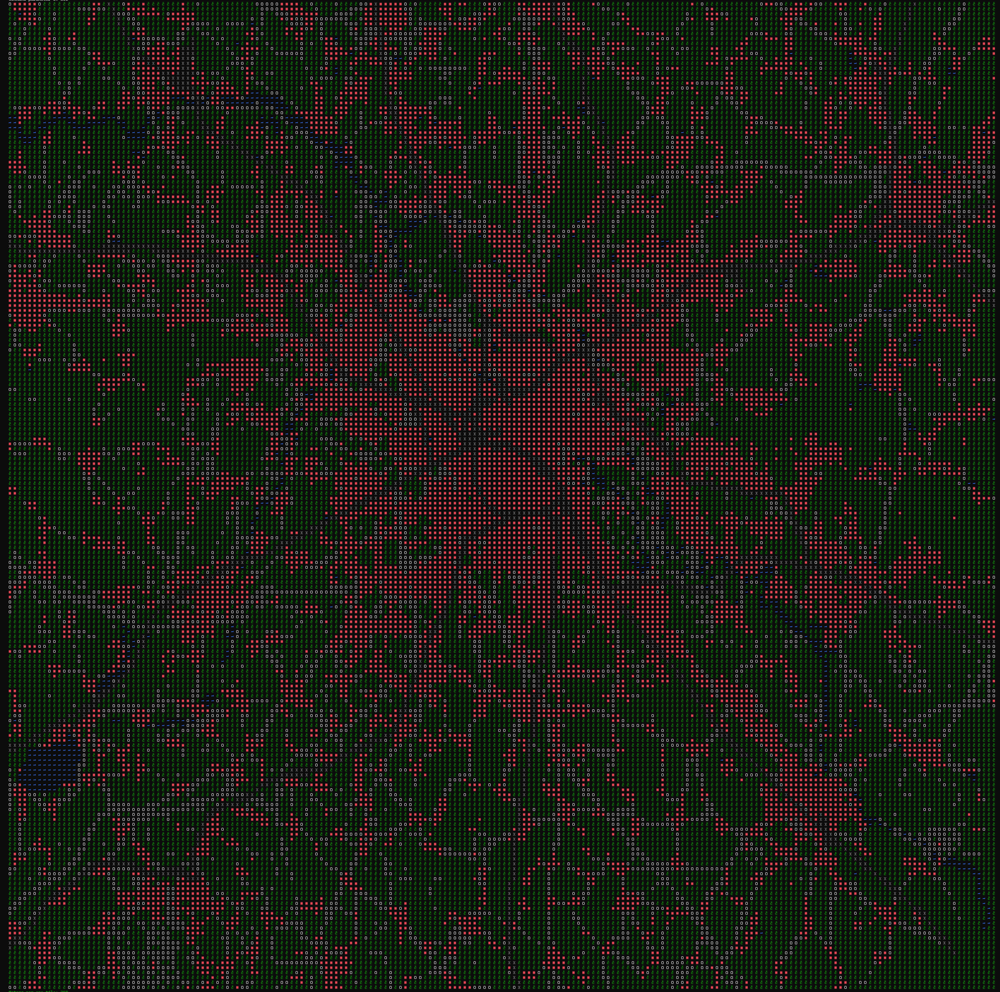
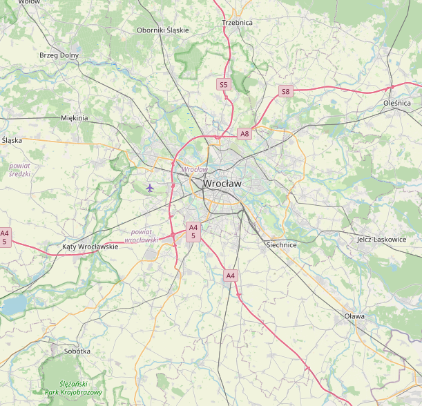

# world2pixel

Small command-line utility to render maps in terminal. Requires a GOL object from Geodesk. Currently only tested for windows, but porting to linux should be really easy, and will eventually be done.

## Usage:
First, make sure you have a GOL object created using Geodesk for the part of the world you want to use. See: https://docs.geodesk.com/gol/build.
Put the GOL file next to the exe. Then in the terminal you can use this command to run the program:

`./world2pixel.exe (latitude) (longitude) (tiles on one side) (length of one side, in meters) (road scale factor) (rail scale factor) (name of gol object, default gol)`

As of now, the program excels at renders with a high resolution (a lot of tiles) and small area. I have included examples of both a large-scale render (50kmx50km @ 200x200 tiles) and a smaller one (1.5kmx1.5km @ 250x250 tiles).

Proper tweaking of road and rail factors helps ensure a good render.

### Examples:

### Small scale:

`.\world2pixel.exe 51.11573, 17.02310 250 1500 1.1 2`  renders the following map (assuming a file called gol.gol exists in current directory, and it contains data for Wroclaw):

Comparing it to the OSM render:

### Large scale:

`.\world2pixel.exe 51.303 16.578 200 50000 50 300`

# Made with love by Hubert Gonera 2025.

# Huge thanks for everyone who creates Geodesk!