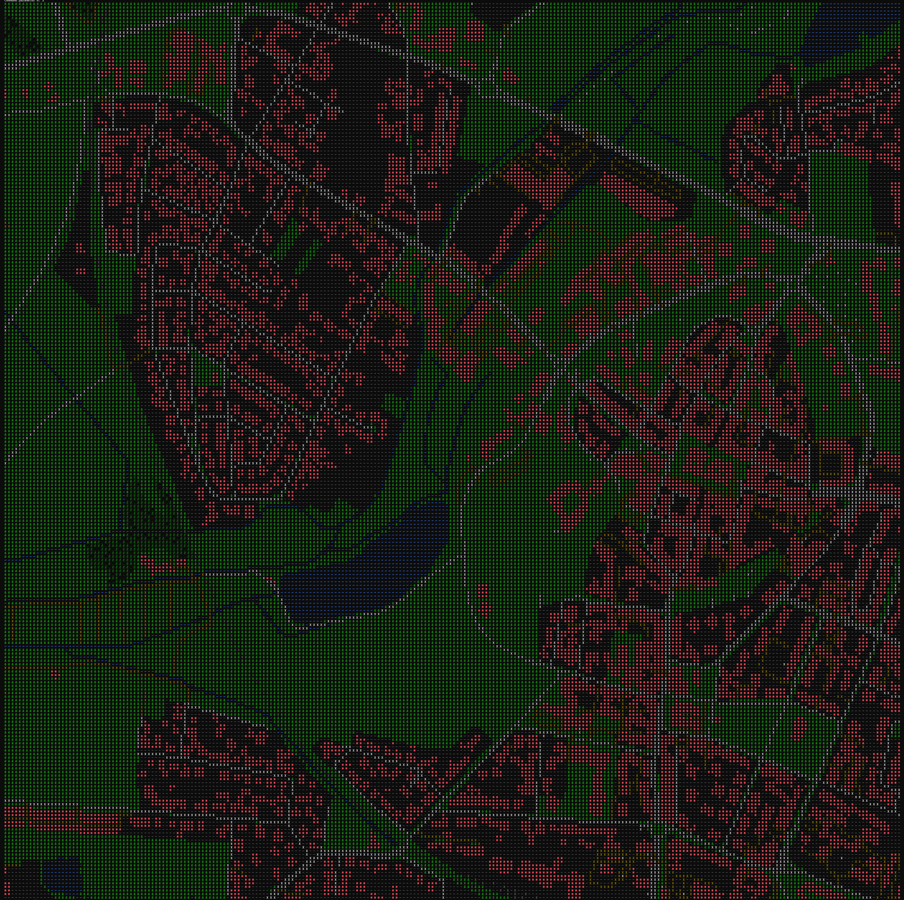

# world2pixel
<b>
Release date: 2025.05.29

EuVer version: 0.2.0
</b>

Small command-line utility to render maps in terminal. Requires a GOL object from Geodesk. Currently only works on windows, as the way I set colors on console is system-dependent. The goal however, is for the program to output to an image file and be system-independent.

## Usage

First, make sure you have a GOL object created using Geodesk for the part of the world you want to use. See: https://docs.geodesk.com/gol/build.
Put the GOL file next to the exe. Then in the terminal you can use this command to run the program:

`./world2pixel.exe (latitude) (longitude) (tiles on one side) (length of one side, in meters) (road scale factor) (rail scale factor) (name of gol object, default gol)`

As of now, the program excels at renders with a high resolution (a lot of tiles) and small area. I have included examples of both a large-scale render (25kmx25km @ 200x200 tiles) and a smaller one (1.5kmx1.5km @ 250x250 tiles).

Proper tweaking of road and rail factors helps ensure a good render. Tweaking the road and rail factor messes with the proper scaling of road width. (A road may appear as 15m in width on the render, while in reality it is 10m.) If you wish to keep road width in 1:1 scale, do not use the factors.

As the image is currently rendered in console, the way it appears will depend on your terminal application. The following screenshots are from the Terminal application from Microsoft Store. As they are screenshots, the quality may be lower than it would appear.

For now, you cannot properly use this program on higher amount of tiles, if you cannot scale the view in your terminal.

## Examples:

(Examples may be slightly outdated)

### Small scale:

`.\world2pixel.exe 51.21654, 17.36196 250 1500 1.7 2`  renders the following map (assuming a file called gol.gol exists in current directory, and it contains data for Wroclaw):

Comparing it to the OSM render:

### Large scale:

`.\world2pixel.exe 51.369433 17.463128 500 25000 10 40`

# Made with love by Hubert Gonera 2025.

# Huge thanks for everyone who creates Geodesk!